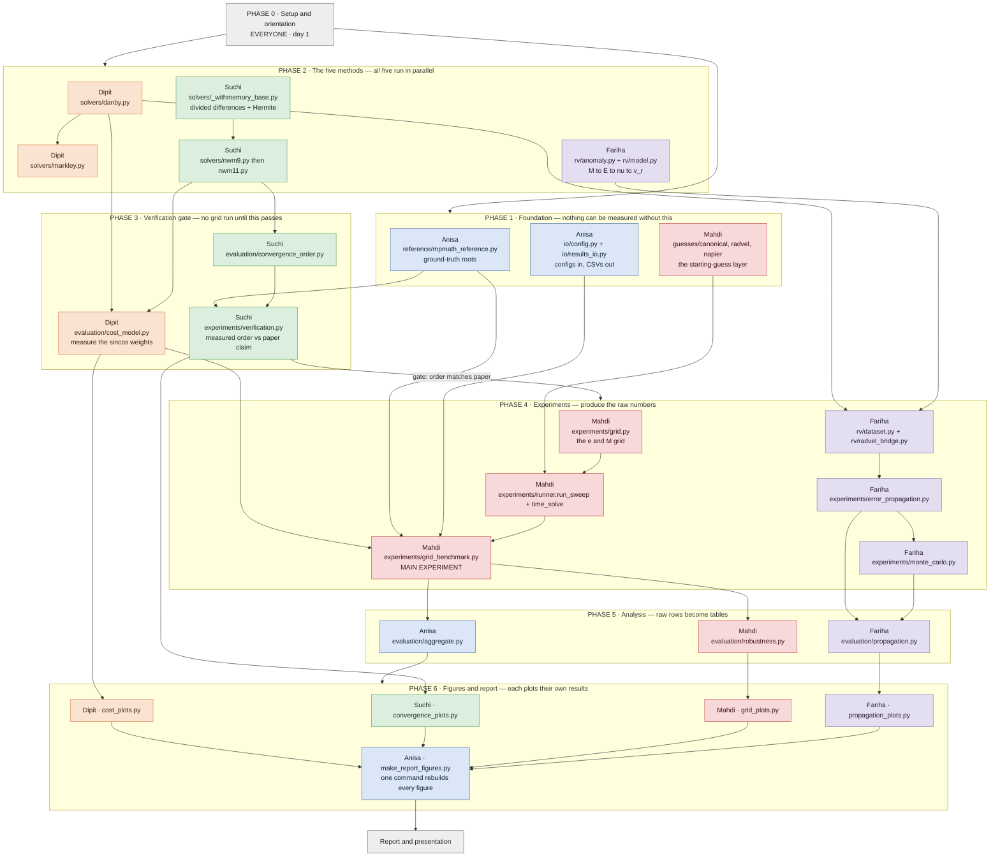
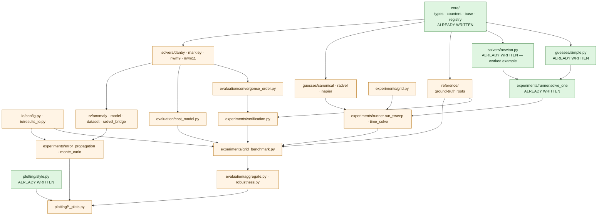

# Team Workflow Guide — "Rooting for Kepler"

**Read this before touching any code.** It assumes you know Python but know
**nothing** about Kepler's equation, root finding, or radial velocities. Every
concept you need is explained in plain English the first time it appears.

The guide is organised by **dependency order**: things that must exist before
other things can be built come first. Follow the phases in order. Inside a
phase, the five of us work in parallel.

- Team: **Anisa, Dipit, Suchi, Mahdi, Fariha**
- Code lives in `src/keplerbench/`
- Everything here is derived from `CSE402 - Project Proposal.pdf`

---

## 1. The whole project in one flowchart



### How to read the flowchart

- **Arrows are hard dependencies.** If an arrow points into your box, that
  work must be finished (or at least importable) before yours can be tested.
- **Boxes in the same subgraph run in parallel.** Phase 2 has all five of us
  working at the same time on different files.
- **The one gate:** the arrow labelled *"gate: order matches paper"*. We do
  not run the main grid benchmark until Suchi's verification step shows each
  solver reaches the convergence order its paper claims. Skipping this gate is
  how a typing mistake turns into a wrong conclusion in the report.

---

## 2. Module dependency map

This is the same information at file level. Read it as *"the thing at the
bottom of an arrow needs the thing at the top"*.



**Green = already written for you.** Read those first; they are the templates
you copy. **Orange = somebody's TODO.**

---

## 3. Phase 0 — setup and orientation (everyone, day 1)

Do all six steps. It takes about 30 minutes.

### Step 1 — get the code running

```bash
cd ~/BUET/4-1/CSE402/Project
python3 -m venv .venv
source .venv/bin/activate
pip install -e ".[dev]"
```

### Step 2 — confirm the test suite is green

```bash
pytest
```

You should see **many SKIPPED tests and zero FAILED tests**. That is correct
and intentional. A test that targets unwritten code *skips*; it starts really
checking things the moment the code exists. See `tests/conftest.py` for how
this works. **Never delete a test to make it pass.**

### Step 3 — watch a solver actually run

```bash
keplerbench list
keplerbench solve --solver newton --guess simple --e 0.5 --M 0.3
```

The second command prints the full iteration trace of Newton's method solving
Kepler's equation. Everything we build is a variation on that output.

### Step 4 — understand the problem in 60 seconds

We are solving one equation, over and over:

```
f(E) = E - e*sin(E) - M = 0
```

- `M` (**mean anomaly**) is basically *"how far along its orbit is the planet,
  if it moved at a constant rate"*. You know it — it comes straight from the
  clock.
- `e` (**eccentricity**) is *"how squashed is the orbit"*. `e = 0` is a perfect
  circle, `e` close to `1` is a very stretched ellipse. You know it.
- `E` (**eccentric anomaly**) is the thing you actually need to work out where
  the planet really is. You do **not** know it, and there is no formula for it.

Because there is no formula, you have to **guess and improve**, over and over,
until the guess is good enough. That is a **root finder**. Newton's method is
the famous one. This project compares five of them.

Why anyone cares: a program called **RadVel** fits planet orbits to telescope
data, and it solves this equation **millions of times per fit**. So the choice
of root finder is a real cost, and any error in `E` leaks into the final
answer about the planet.

### Step 5 — read the shared contract (30 lines that everything depends on)

Read these three files, in this order. Do not skip this — every single one of
us writes code against them.

1. `src/keplerbench/core/types.py` — the `KeplerProblem` object. **You never
   call `math.sin` yourself.** You ask the problem object, and it quietly
   counts what you used. This is how we measure cost fairly.
2. `src/keplerbench/core/base.py` — the two base classes. `InitialGuess` turns
   `(e, M)` into a first guess. `IterativeSolver` already contains the whole
   loop, the stopping test and the failure handling, so **you only write the
   one-line update rule** in `step()`.
3. `src/keplerbench/core/counters.py` — what "cost" means in this project.

### Step 6 — read the worked example

`src/keplerbench/solvers/newton.py` is fully implemented on purpose. It is
nine lines. Every other solver is that shape. Read it, then read
`src/keplerbench/guesses/simple.py` (three lines) for the guess shape.

### Step 7 — make your branch

```bash
git checkout -b anisa-core      # or dipit-solvers / suchi-withmemory /
                                # mahdi-grid / fariha-rv
```

One branch per person. Merge into `main` only when `pytest` is green.

---

## 4. Who owns what

| Person | Theme | Files owned |
|---|---|---|
| **Anisa** | Framework, ground truth, integration | `core/*`, `reference/*`, `io/*`, `cli.py`, `evaluation/metrics.py`, `evaluation/aggregate.py`, `plotting/style.py`, `scripts/make_report_figures.py`, `tests/conftest.py`, `tests/test_core.py`, `tests/test_solver_contract.py`, `tests/test_reference.py` |
| **Dipit** | Classical + established solvers, cost model | `solvers/newton.py`, `solvers/danby.py`, `solvers/markley.py`, `evaluation/cost_model.py`, `plotting/cost_plots.py`, `tests/test_solvers_classical.py` |
| **Suchi** | With-memory solvers, convergence order, verification | `solvers/_withmemory_base.py`, `solvers/nwm9.py`, `solvers/nwm11.py`, `evaluation/convergence_order.py`, `experiments/verification.py`, `plotting/convergence_plots.py`, `tests/test_solvers_withmemory.py` |
| **Mahdi** | Guess layer, grid, main benchmark | `guesses/*`, `experiments/grid.py`, `experiments/runner.py`, `experiments/grid_benchmark.py`, `evaluation/robustness.py`, `plotting/grid_plots.py`, `tests/test_guesses.py`, `tests/test_experiments.py` |
| **Fariha** | Downstream radial-velocity study | `rv/*`, `experiments/error_propagation.py`, `experiments/monte_carlo.py`, `evaluation/propagation.py`, `plotting/propagation_plots.py`, `tests/test_rv.py` |

Rule: **edit only your own files.** If you need a change in someone else's
file, message them. The one exception is `core/` — if a signature there has to
change, Anisa changes it and tells everyone, because it breaks all five of us
at once.

---

## 5. Anisa — framework, ground truth, integration

**Your one-line job:** make sure everyone else's numbers are comparable,
reproducible and traceable.

### Concepts you need

- **Ground truth.** To say "solver X has an error of 1e-12", you need the
  *true* answer to compare against. We get it by solving the same equation at
  50 decimal digits with `mpmath`, using a **bracketing** method (one that
  traps the root between two values and squeezes). It must not be Newton or
  any of the five methods under test — otherwise we would be grading them
  against themselves.
- **Reproducibility.** Every number in the report must be regenerable from a
  config file plus one command. That is why configs are YAML and results are
  CSV with a recorded fingerprint.

### Files to read, in order

1. `core/types.py`, `core/base.py`, `core/counters.py` — you own these; they
   are already written, but you are now the person who understands them.
2. `core/registry.py` — how a string like `"danby"` becomes a solver object.
3. `configs/default.yaml` and `configs/grid_benchmark.yaml` — the shape
   `io/config.py` has to parse.
4. `tests/test_reference.py` and `tests/test_core.py` — your definition of done.

### Files to write, in dependency order

| # | File | Done when |
|---|---|---|
| 1 | `reference/mpmath_reference.py` | `pytest tests/test_reference.py` passes with no skips |
| 2 | `io/config.py` | loading each file in `configs/` returns a valid object and an unknown solver name fails loudly |
| 3 | `io/results_io.py` | a list of `SolveResult` round-trips to CSV and back |
| 4 | `evaluation/metrics.py` | `pytest tests/test_evaluation.py -k efficiency` passes |
| 5 | `evaluation/aggregate.py` | **needs Mahdi's `results/grid_benchmark/raw.csv`** — wait for Phase 4 |
| 6 | `scripts/make_report_figures.py` | **last thing in the project**; one command rebuilds every figure |

### Blocking relationships

- **You block:** Suchi (needs `reference_root` to check correctness), Mahdi
  (needs config loading + result writing + reference roots for the grid).
- **You are blocked by:** nobody in Phase 1. Start immediately — you are on
  the critical path.

---

## 6. Dipit — baseline and established Kepler solvers

**Your one-line job:** implement the two solvers that represent "what people
actually use today", and work out what one iteration really costs.

### Concepts you need

- **Newton's method** (already written for you in `solvers/newton.py`): guess
  `E`, compute how wrong you are, slide along the tangent line, repeat. It
  roughly *doubles* the number of correct digits each step — that is what
  "order 2" means.
- **Danby's method** is Newton with two extra correction terms bolted on. It
  roughly *quadruples* correct digits per step (order 4). The reason it is
  worth it on this specific equation: `f`, `f'`, `f''` and `f'''` of Kepler's
  equation are all made of the *same* `sin E` and `cos E`, so the extra
  accuracy is nearly free. This is RadVel's production solver.
- **Markley's method** is different in kind: it is **not** an iteration. It
  builds an answer from a closed-form formula and applies one fixed
  correction. Same cost every time, no convergence loop. That is why it
  subclasses `KeplerSolver` directly instead of `IterativeSolver`.
- **The cost question (this is your headline contribution).** The project's
  central argument is that counting "function evaluations" is the wrong
  currency here, because one `sincos` call gives you `sin E` *and* `cos E`
  together. You are the one who measures whether that discount is real.

### Files to read, in order

1. `solvers/newton.py` — your template. Nine lines.
2. `core/types.py`, specifically `KeplerProblem.derivatives()` — this is how
   you get `f, f', f'', f'''` from **one** `sincos` call, which is exactly the
   thing Danby is supposed to exploit.
3. `core/base.py`, class `IterativeSolver` — note that the loop, the stopping
   rule and the error handling are already done. You write only `step()`.
4. `tests/test_solvers_classical.py` — your definition of done.
5. Danby (1987) and Markley (1995) — the two papers. The class docstrings name
   the exact DOIs.

### Files to write, in dependency order

| # | File | Done when |
|---|---|---|
| 1 | `solvers/danby.py` | matches `scipy.optimize.brentq` to 1e-10 on every test point, and converges in ≤ 6 iterations from the simple guess |
| 2 | `solvers/markley.py` | matches `brentq` to 1e-10 everywhere, and reports `iterations == 0` |
| 3 | `evaluation/cost_model.py` → `measure_weights()` | you can state, with timings, what a `sincos` pair costs relative to a plain `sin` **on our machine** |
| 4 | `evaluation/cost_model.py` → `weighted_cost`, `cost_per_correct_digit`, `per_iteration_cost_table` | **needs Suchi's solvers to exist** — Phase 3 |
| 5 | `plotting/cost_plots.py` | Phase 6 |

### A warning that will save you a day

`per_iteration_cost_table()` must be **measured from the instrumented code**,
not typed in by hand from the papers. Run one solve with
`record_history=True` and read the per-iteration deltas out of the recorded
cost snapshots. If the measured counts disagree with what the proposal's
method table claims, **that is a finding** — report it, do not quietly fix the
table.

Also: be honest about whether CPython actually gives a discount for computing
`sin` and `cos` together. If it does not, the proposal's cost argument still
holds for a compiled implementation like RadVel's, but not for our pure-Python
harness — and **both costings belong in the report**.

### Blocking relationships

- **You block:** Fariha (her RV model needs a fast, correct solver — Danby is
  the natural default), Mahdi's main benchmark, and the cost table that the
  whole comparison rests on.
- **You are blocked by:** nobody. Start immediately.

---

## 7. Suchi — with-memory solvers and the verification gate

**Your one-line job:** implement the two 2024–2025 methods that are the whole
reason this project exists, and prove they actually behave as their papers
claim before anyone benchmarks them.

### Concepts you need

- **"With memory" in one sentence:** an ordinary method throws away everything
  it computed in step *n* before starting step *n+1*; a with-memory method
  keeps those numbers and reuses them to tune itself, which raises the
  convergence order **for free** — no extra evaluations.
- **Self-accelerating parameter.** The extra speed comes from a number the
  method recomputes each iteration by fitting a polynomial through points it
  already evaluated (**Hermite / Newton interpolation**). Getting derivative
  information this way instead of evaluating it is called a **synthesised**
  derivative, and we count those separately — see
  `CostCounter.synthesised_derivatives`.
- **Convergence order, measured not assumed.** "Order 10.7446" means the
  number of correct digits multiplies by about 10.7 each step. The proposal is
  explicit that we **measure** this from the residual sequence rather than
  trusting the paper. The estimator is:
  `p ≈ ln|e_{n+1}/e_n| / ln|e_n/e_{n-1}|`, where `e_n` is the error at step n.
- **The trap you will hit.** At order ~10, starting from a decent guess, you
  reach the limit of double precision (about 16 digits) in **two** iterations.
  That leaves too few points to estimate the order at all, and you will think
  your code is broken when it is fine. **Run the verification in `mpmath` at
  100 digits.** This is the single most common false alarm in this kind of
  study.

### Files to read, in order

1. `solvers/newton.py` — the simplest possible `step()`.
2. `core/base.py`, class `IterativeSolver` — pay attention to `init_state()`
   and the `state` dict passed into `step()`. That dict **is** the memory.
3. `solvers/_withmemory_base.py` — the scratchpad you fill in first:
   `MemoryState`, `newton_divided_differences`, `hermite_derivative_estimate`.
4. `evaluation/convergence_order.py` — the estimator you will write.
5. `tests/test_solvers_withmemory.py` and `tests/test_evaluation.py` — your
   definition of done.
6. The two papers: Mittal, Panday & Jäntschi (2024) for NWM9; Mittal, Panday,
   Jäntschi & Bolunduț (2025) for NWM11. DOIs are in the class docstrings.

### Files to write, in dependency order

| # | File | Done when |
|---|---|---|
| 1 | `solvers/_withmemory_base.py` → `newton_divided_differences` | the 4th divided difference of a cubic is zero (test already written) |
| 2 | `solvers/_withmemory_base.py` → `hermite_derivative_estimate` | recovers `d/dx e^x` at `x=1` to 1e-4 |
| 3 | `evaluation/convergence_order.py` | recovers `p = 3` from a synthetic sequence built with `e_{n+1} = 0.5 * e_n^3` |
| 4 | `solvers/nwm9.py` — **memoryless base only, first** | reaches order ≈ 8 on the paper's own test functions |
| 5 | `solvers/nwm9.py` — **then add the memory** | order rises to ≈ 8.8989 |
| 6 | `solvers/nwm11.py` | order ≈ 10.7446; **and** the cost counters show 3 evaluation points with only 1 `sincos` pair per iteration, as the proposal's table claims |
| 7 | `experiments/verification.py` | `python scripts/run_verification.py` prints PASS for every solver |
| 8 | `plotting/convergence_plots.py` | Phase 6 |

### The two-stage rule (do not skip it)

Implement the **memoryless base method first** and verify it hits its plain
order (8) before you add the self-accelerating parameter. If you write both at
once and the order comes out wrong, you cannot tell which half is broken. This
will cost you more time than it saves.

Second check, once memory is added: assert that the accelerating parameters
**change** between iteration 1 and iteration 2. If they stay at their initial
value, the memory is not wired up and your method has silently degraded into
its memoryless base — which would look like "with-memory does not help" in the
report, and would be wrong.

### Blocking relationships

- **You block: everyone.** Your verification step is the gate before the main
  grid benchmark. Dipit's cost table also needs your solvers.
- **You are blocked by:** Anisa's `reference_root` (only for the Kepler
  correctness check, not for the solvers themselves). Start on
  `_withmemory_base.py` on day 1; you do not need anything from anyone.

---

## 8. Mahdi — guess layer, grid, and the main experiment

**Your one-line job:** build the starting-guess layer, define where in
`(e, M)` space we test, and run the experiment that produces most of the
report's numbers.

### Concepts you need

- **Why the starting guess is a separate factor.** Every iterative solver
  needs a first estimate of `E`. A better first estimate means fewer
  iterations — but that has **nothing to do with how good the iteration is**.
  The proposal insists these two effects are never mixed up, which is why
  guesses live in their own package and every solver is run with every guess.
- **The four guesses.** `simple` is `E0 = M` (free, already written).
  `canonical` is `E0 = M + e·sin M`. `radvel` is whatever RadVel itself uses
  (copy it exactly from its source). `napier` is a formula found by **symbolic
  regression** — a machine-learning search over algebraic expressions — in a
  2024 paper.
- **The pathological corner.** When `e` is close to 1 and `M` is close to 0,
  Kepler's equation becomes nasty and Newton-type methods are known to
  struggle. This tiny region is where the methods actually differ. A uniform
  grid puts almost no points there, so you must sample it deliberately, with
  **logarithmic** spacing in `(1 - e)` and in `M`.

### Files to read, in order

1. `guesses/simple.py` — your three-line template.
2. `core/base.py`, class `InitialGuess`.
3. `experiments/runner.py`, function `solve_one` — **already written, and it
   is the fairness contract of the whole project.** Every solver goes through
   it, so every solver gets the same stopping rule and the same cost
   instrumentation. Your `run_sweep` must call it, never bypass it.
4. `experiments/grid.py` — the three grid functions you will write.
5. `configs/grid_benchmark.yaml` — the settings your experiment reads.
6. `tests/test_guesses.py` and `tests/test_experiments.py` — definition of done.
7. Napier (2024), arXiv:2411.15374 — for the guess formula.

### Files to write, in dependency order

| # | File | Done when |
|---|---|---|
| 1 | `guesses/canonical.py` | exact at `e = 0`; `pytest tests/test_guesses.py` has fewer skips |
| 2 | `guesses/radvel_start.py` | matches RadVel's source exactly; note the RadVel version in the docstring |
| 3 | `guesses/napier.py` (+ `_normalise_M`) | exact at `e = 0`, and respects the symmetry `E(2π − M) = 2π − E(M)` |
| 4 | `experiments/grid.py` | all three grid tests pass; the pathological grid really is in the corner |
| 5 | `experiments/runner.py` → `run_sweep` | **needs all five solvers** — Phase 4 |
| 6 | `experiments/runner.py` → `time_solve` | median-of-many, with warm-up |
| 7 | `experiments/grid_benchmark.py` | `python scripts/run_grid_benchmark.py` writes `results/grid_benchmark/raw.csv` |
| 8 | `evaluation/robustness.py` | failure rates split by region |
| 9 | `plotting/grid_plots.py` | Phase 6 |

### Three practical warnings

1. **`run_sweep` must not die when a teammate's solver is unfinished.** Catch
   `NotImplementedError` per combination, warn, and continue. Otherwise you
   cannot test anything until everyone is done.
2. **Markley ignores the guess.** Running it once per guess would put five
   identical rows in the results table. Run it under a single pseudo-guess
   label `"n/a"`.
3. **The full grid is big.** 5 solvers × 4 guesses × thousands of points. Add
   a `--limit` option for smoke runs, keep `record_history` **off** for the
   big run (memory), and turn it on only for the small sub-grid that feeds
   Suchi's convergence figures.

### Blocking relationships

- **You block:** Anisa's `aggregate.py` and every figure in Phase 6 — your
  `raw.csv` is the input to almost all of them.
- **You are blocked by:** Anisa (config + results IO + reference roots) and by
  all five solvers, for the final run only. **Guesses and `grid.py` need
  nothing from anyone — start there on day 1.**

---

## 9. Fariha — downstream radial-velocity study

**Your one-line job:** answer the question "does any of this actually matter?"
by tracing solver error all the way into the fitted properties of a real
planet.

### Concepts you need

- **Radial velocity, in one paragraph.** A planet tugs its star back and
  forth. We see that as the star's light shifting slightly bluer and redder
  over time. From that wobble you can fit the planet's orbit: its period `P`,
  eccentricity `e`, and the size of the wobble `K`. **RadVel** is the standard
  software that does this fit.
- **The chain you own:** `M → E → ν → v_r`. Time gives you `M`. The Kepler
  solver gives you `E` (that is where the five methods plug in). `ν` (true
  anomaly) is the planet's actual angle. `v_r` is the star's velocity we
  observe. So an error in `E` travels down this chain into the fitted `P`,
  `e`, `K`.
- **Why the comparison matters more than the number.** Finding "the solver
  shifts the fitted period by 0.0003 days" means nothing on its own. It only
  means something next to two other numbers: how much the period moves anyway
  because the **data are noisy** (that is the Monte Carlo study), and how wide
  RadVel's own **MCMC posterior** is (MCMC = a method that reports a *range*
  of plausible values rather than one answer). Your final deliverable is one
  table putting all three side by side.

### Files to read, in order

1. `rv/anomaly.py` — the three links of the chain, one function each.
2. `rv/model.py` — how a full velocity curve is built from those links.
3. `experiments/runner.py`, function `solve_one` — your model must call
   solvers through this, so the cost accounting stays valid downstream too.
4. `rv/radvel_bridge.py` — how we swap our solver into RadVel.
5. `configs/error_propagation.yaml` and `configs/monte_carlo.yaml`.
6. `tests/test_rv.py` — your definition of done.
7. Fulton et al. (2018), the RadVel paper, for the model conventions.

### Files to write, in dependency order

| # | File | Done when |
|---|---|---|
| 1 | `rv/anomaly.py` | all four tests in `tests/test_rv.py` pass |
| 2 | `rv/model.py` | a synthetic curve round-trips: generate with known `P, e, K`, fit, recover them |
| 3 | `rv/dataset.py` + fill in `data/README.md` | a real dataset loads, and its source is cited |
| 4 | `rv/radvel_bridge.py` | the patch assertion fires — see the warning below |
| 5 | `experiments/error_propagation.py` | `results/error_propagation/raw.csv` exists |
| 6 | `experiments/monte_carlo.py` | `results/monte_carlo/raw.csv` exists |
| 7 | `evaluation/propagation.py` | the three-way comparison table builds |
| 8 | `plotting/propagation_plots.py` | Phase 6 |

### Two warnings worth more than the rest of this section

1. **Use the stable half-angle formula for `ν`.** The textbook
   `tan(ν/2) = sqrt((1+e)/(1−e))·tan(E/2)` loses the quadrant and blows up
   near `E = π`. Use
   `ν = 2·atan2( sqrt(1+e)·sin(E/2), sqrt(1−e)·cos(E/2) )`.
2. **Prove your RadVel patch actually took effect.** RadVel may run a compiled
   Cython Kepler solver, in which case patching the pure-Python one does
   *nothing* — and your results would look perfectly reasonable and mean
   absolutely nothing. Add a call counter that must be non-zero after a fit,
   and assert on it. This is the biggest single risk in the whole project.
3. Also: pick a system with a **moderately eccentric** orbit. On a near-circular
   orbit the Kepler solver barely matters and your study would measure noise.

### Blocking relationships

- **You block:** nobody, until the report. Your track runs in parallel.
- **You are blocked by:** Dipit's Danby solver (you need one fast, correct
  solver to fit with). **`rv/anomaly.py` needs nothing from anyone — start
  there on day 1**, it is pure trigonometry.

---

## 10. Milestones and integration checkpoints

Meet at each checkpoint. Nobody moves to the next phase alone.

| # | Checkpoint | Whose work must be done | How we check it |
|---|---|---|---|
| **M0** | Everyone can run the code | all | `pytest` green, `keplerbench solve` works for all |
| **M1** | We can measure error | Anisa (`reference/`) | `pytest tests/test_reference.py` — no skips |
| **M2** | All five solvers find the right root | Dipit, Suchi | `pytest tests/test_solver_contract.py` — no skips |
| **M3** | **The verification gate** | Suchi (+ Anisa's M1) | `python scripts/run_verification.py` prints PASS for every solver |
| **M4** | Main experiment has run | Mahdi (+ M2, M3) | `results/grid_benchmark/raw.csv` exists and `summary.csv` builds |
| **M5** | Downstream study has run | Fariha | `results/error_propagation/` and `results/monte_carlo/` populated |
| **M6** | Report figures rebuild from scratch | Anisa | `python scripts/make_report_figures.py` regenerates every figure |

If **M3 fails** — a measured order does not match its paper — stop and debug
before M4. Benchmarking a solver that does not do what its paper says produces
a conclusion about our typing, not about the method.

---

## 11. Rules that keep five people from breaking each other

1. **Never call `math.sin` / `math.cos` directly inside a solver.** Go through
   `KeplerProblem`. A solver that bypasses it reports zero cost, and
   `tests/test_solver_contract.py` will catch you.
2. **Never call a solver directly from an experiment.** Go through
   `experiments.runner.solve_one`. That is what makes the comparison fair.
3. **Never hand-edit a result file.** If a number looks wrong, fix the code
   and re-run. Everything in `results/` is git-ignored and reproducible.
4. **Never invent a number for the report.** A blank cell in a table is fine;
   a made-up one is not. If a run did not happen, say so.
5. **Never delete a test to make it pass.** Skipping is the correct state for
   unwritten code — see `tests/conftest.py`.
6. **A plotting function never computes a metric.** It takes a DataFrame that
   `evaluation/` produced and draws it. That way every figure traces back to a
   result file.
7. **Only Anisa changes `core/`**, and she announces it, because it breaks all
   five of us simultaneously.
8. **Record the surprises.** If the measured cost, order, or iteration count
   disagrees with a paper, that is a result, not a bug to hide. The proposal
   explicitly says the outcome is not fixed in advance.

---

## 12. Glossary

| Term | Plain English |
|---|---|
| **Kepler's equation** | `E − e·sin E − M = 0`. No formula for `E`; must be solved numerically. |
| **Mean anomaly `M`** | Where the planet would be if it orbited at constant speed. Known. |
| **Eccentric anomaly `E`** | The quantity we must solve for. |
| **True anomaly `ν`** | The planet's actual angle in its orbit. Computed from `E`. |
| **Eccentricity `e`** | How stretched the orbit is. 0 = circle, near 1 = very stretched. |
| **Root finder** | An algorithm that improves a guess until `f(x) = 0`. |
| **Convergence order** | How fast correct digits multiply per step. Order 2 ≈ doubles, order 10 ≈ ten-folds. |
| **Residual** | `\|f(E)\|` — how far from zero we still are. |
| **With-memory method** | Reuses values from earlier iterations to speed itself up for free. |
| **Self-accelerating parameter** | The tuning number a with-memory method recomputes each step. |
| **Divided differences / Hermite interpolation** | Fitting a polynomial through known points to estimate a derivative without evaluating it. |
| **Synthesised derivative** | A derivative obtained that way rather than by a real evaluation. We count these separately. |
| **sincos pair** | One call giving both `sin E` and `cos E`. Cheaper than two separate calls — the crux of the project's cost argument. |
| **Efficiency index** | `order^(1/evaluations)`. The generic textbook measure. The project argues it misses Kepler's cost structure. |
| **Pathological corner** | `e → 1`, `M → 0`. Where Newton-type methods struggle. |
| **Radial velocity (RV)** | The star's back-and-forth motion, measured from its light. |
| **RadVel** | The standard software that fits planet orbits to RV data. Uses Danby's method. |
| **MCMC / posterior** | A fitting method that returns a range of plausible parameter values; its width is our yardstick for "does solver error matter". |

---

## 13. If you are stuck

- **"I don't know what my function should return."** Open the matching test in
  `tests/` — it is the specification.
- **"My solver gives the wrong answer."** Compare against
  `scipy.optimize.brentq` on the same `(e, M)`; see
  `tests/test_solvers_classical.py` for the pattern.
- **"Everything skips when I run pytest."** That is correct until the code
  exists. Run `pytest -rs` to see exactly which skips are yours.
- **"I need something from someone else's file."** Ask them. Do not edit it,
  and do not copy it into yours.
